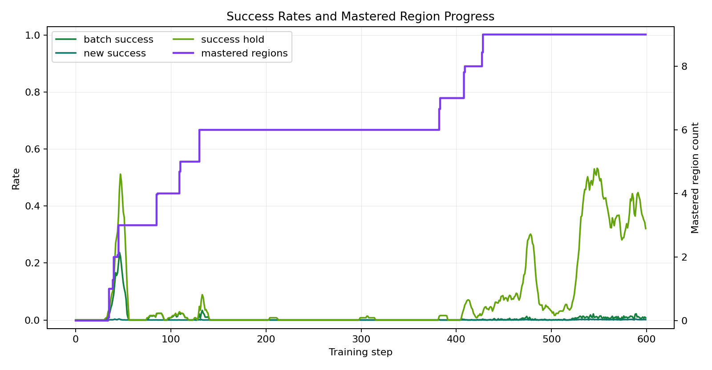
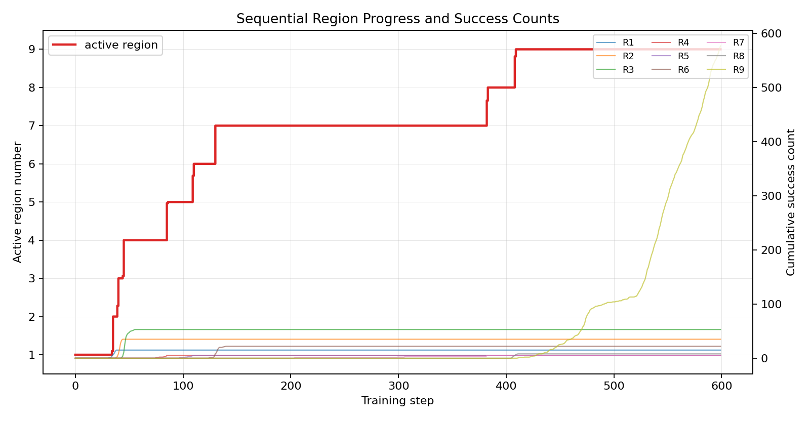
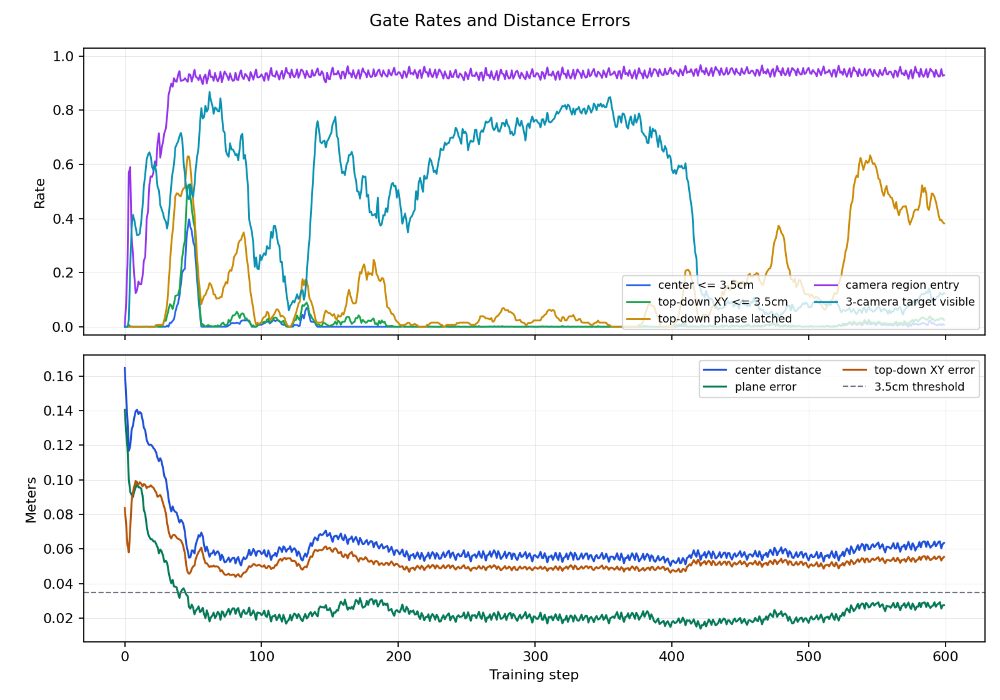

# 2026-06-12 MT4 Stage 1 순차 9영역 5회 성공 분석

## 한국어

### 목적

Stage 1 plane localization을 1번 영역부터 9번 영역까지 순서대로 학습한다. 각 영역은 새 성공 5회 이상이면 mastered로 표시하고, mastered 영역은 이후 보상을 제거해서 다음 영역으로 정책 압력이 넘어가도록 했다. 모든 실행은 IsaacLab simulation에서만 진행했고, 실제 MT4 로봇 motion은 실행하지 않았다.

### 코드/스크립트 변경

| 파일 | 변경 |
| --- | --- |
| `source/mirobot_reach_direct/mirobot_coordinate_curriculum_env.py` | Stage 1 plane의 `region_mastery_successes`를 `10 -> 5`로 완화했다. |
| `source/mirobot_reach_direct/mirobot_coordinate_curriculum_env.py` | center-first 영역 순서를 제거하고 `1..9` 순차 영역 순서를 사용한다. |
| `source/mirobot_reach_direct/mirobot_coordinate_curriculum_env.py` | mastered 영역의 reward를 0으로 마스킹해서 같은 영역을 계속 보상받지 않게 했다. |
| `scripts/train_mirobot_coordinate_stage1_plane_128_600.sh` | run 설명과 기본 run name을 `mt4_coordinate_plane_seq9_5success_035_128env_600iter`로 갱신했다. |

### 학습 실행

| 항목 | 값 |
| --- | --- |
| run name | `mt4_coordinate_plane_seq9_5success_035_128env_600iter` |
| task | `Mirobot-Coordinate-Plane-Direct-v0` |
| num envs | `128` |
| max iterations | `600` |
| seed | `42` |
| center success radius | `0.035 m` |
| top-down XY success radius | `0.035 m` |
| region mastery threshold | `5` new successes |
| scalar steps | `0..599` |
| scalar wall time | `469.66 s` |
| run dir | `/home/spark-robotics/work/isaac/src/IsaacLab/logs/rsl_rl/mirobot_coordinate_curriculum_direct/2026-06-12_07-46-24_mt4_coordinate_plane_seq9_5success_035_128env_600iter` |

학습 명령:

```bash
MT4_MAX_ITERATIONS=600 ./scripts/train_mirobot_coordinate_stage1_plane_128_600.sh
```

### 그래프와 CSV

| 파일 | 용도 |
| --- | --- |
| `logs/plots/20260612_seq9_5success/success_mastery_curve.png` | batch/new/hold success와 mastered region count |
| `logs/plots/20260612_seq9_5success/region_progress_curve.png` | active region 전환과 영역별 누적 success count |
| `logs/plots/20260612_seq9_5success/region_success_counts.png` | 최종 영역별 success count |
| `logs/plots/20260612_seq9_5success/gate_error_curve.png` | center/top-down/camera gate rate와 거리 error |
| `logs/plots/20260612_seq9_5success/reward_curve.png` | mean reward 변화 |
| `logs/plots/20260612_seq9_5success/metric_summary.csv` | 주요 TensorBoard scalar의 final/max 요약 |
| `logs/plots/20260612_seq9_5success/scalar_timeseries.csv` | 추출한 scalar 시계열 |
| `logs/plots/20260612_seq9_5success/region_mastery.csv` | 최종 region mastery snapshot |







### 최종 지표와 최고 지표

| 지표 | 최종값 | 최고값 |
| --- | ---: | ---: |
| `Train/mean_reward` | `0.00` | `10709.30` at step `407` |
| `plane_localization_success_rate` | `0.0073` | `0.2371` at step `46` |
| `plane_localization_new_success_rate` | `0.0012` | `0.0034` at step `46` |
| `plane_localization_success_hold_rate` | `0.3210` | `0.5327` at step `548` |
| `mastered_region_count` | `9` | `9` from step `428` |
| `active_region_number` | `9` | `9` from step `409` |
| `center_success_radius_rate` | `0.0073` | `0.3972` at step `47` |
| `top_down_xy_success_radius_rate` | `0.0249` | `0.5264` at step `47` |
| `top_down_phase_latched_rate` | `0.3821` | `0.6333` at step `545` |
| `camera_region_entry_rate` | `0.9297` | `0.9668` at step `421` |
| `camera_region_match_rate` | `1.0000` | `1.0000` |
| `target_three_camera_visible_rate` | `0.1235` | `0.8677` at step `62` |
| `mean_distance` | `0.0636 m` | - |
| `mean_plane_error` | `0.0275 m` | - |
| `mean_top_down_xy_error` | `0.0554 m` | - |
| `near_center_7cm_rate` | `0.8079` | `0.9421` at step `511` |

### 영역별 결과

| region | mastered step | final success count | best episode reward |
| ---: | ---: | ---: | ---: |
| 1 | `35` | `15` | `5276.37` |
| 2 | `40` | `35` | `2742.22` |
| 3 | `45` | `53` | `2655.80` |
| 4 | `85` | `5` | `4674.84` |
| 5 | `109` | `5` | `2160.06` |
| 6 | `130` | `22` | `7957.88` |
| 7 | `382` | `5` | `1332.31` |
| 8 | `408` | `8` | `1186.72` |
| 9 | `428` | `578` | `916.98` |

### 분석

이번 변경은 목표했던 순차 영역 학습 조건을 통과했다. `mastered_region_count`는 step `428`에서 `9/9`에 도달했고, 최종 `region_mastery.csv`도 모든 영역의 `mastered=1`을 기록했다. 이전 Stage 1 run이 `mastered_region_count=4`에서 후반 active region 안정화에 실패했던 것과 비교하면, 5회 성공 threshold와 mastered reward masking은 다음 영역으로 넘어가는 목적에는 효과가 있었다.

최종 `Train/mean_reward=0.00`은 정책이 완전히 실패했다는 뜻이 아니다. 모든 영역이 mastered된 뒤에는 현재 sampled target도 mastered 영역이므로 reward가 0으로 마스킹된다. 따라서 이 run의 1차 판정 지표는 final reward가 아니라 `mastered_region_count=9`, `region_mastery.csv`, 영역별 success count다.

다만 최종 batch success는 낮다. 최종 `success_rate=0.0073`, `center_success_radius_rate=0.0073`, `top_down_xy_success_radius_rate=0.0249`이고, `mean_top_down_xy_error=0.0554 m`로 3.5cm gate 밖에 있다. 즉 순차 mastery 판정은 통과했지만, 모든 영역을 마스터한 뒤에도 일반 batch에서 안정적으로 3.5cm center/top-down 조건을 유지하는 정책으로 굳지는 않았다.

카메라 region 인식 자체는 안정적이다. 최종 `camera_region_entry_rate=0.9297`, `camera_region_match_rate=1.0000`이라 영역 분류 문제보다는 gripper-center 접근 정밀도와 target visibility 유지가 남은 병목이다. 특히 `target_three_camera_visible_rate`가 최고 `0.8677`에서 최종 `0.1235`로 떨어진 점은 후반 정책이 visibility를 희생하면서 영역 완료만 충족했을 가능성을 보여준다.

### 다음 판단

Stage 2로 바로 올리기 전, Stage 1을 짧게 검증하는 별도 play/eval이 필요하다. 학습 중 success latch와 mastery snapshot은 통과했지만, final checkpoint의 batch success가 낮아서 실제 사용할 policy로는 아직 불안정하다.

다음 학습에서는 모든 영역 mastered 이후 reward가 완전히 0이 되는 상태를 피하는 holdout/eval 보상을 따로 두는 편이 좋다. 예를 들어 mastered 영역의 training reward는 계속 제거하되, eval metric은 마스킹하지 않고 기록하거나, all-mastered 이후에는 전체 9영역 uniform sampling + 작은 유지 보상으로 전환한다.

## English

This run changed Stage 1 plane localization to sequential region progression from region 1 to 9. Each region is mastered after 5 new successes, and rewards for mastered regions are masked out. The run reached `mastered_region_count=9` at step `428`, and the final `region_mastery.csv` marks all 9 regions as mastered.

The final `Train/mean_reward=0.00` is expected after all regions are mastered because rewards are masked for mastered targets. The remaining risk is policy stability: final batch `success_rate=0.0073`, final `top_down_xy_success_radius_rate=0.0249`, and final `mean_top_down_xy_error=0.0554 m` show that the final checkpoint is not yet a strong Stage 2 handoff policy.
